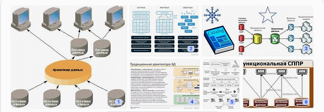
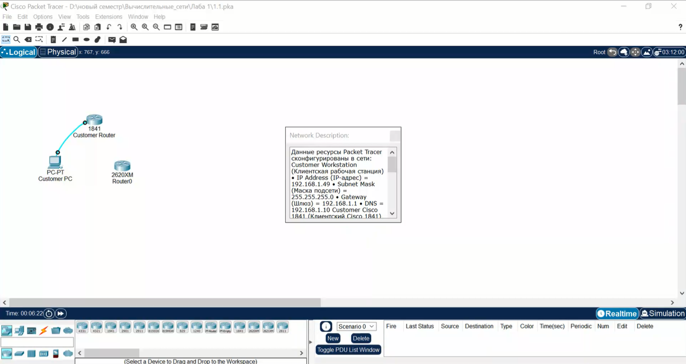
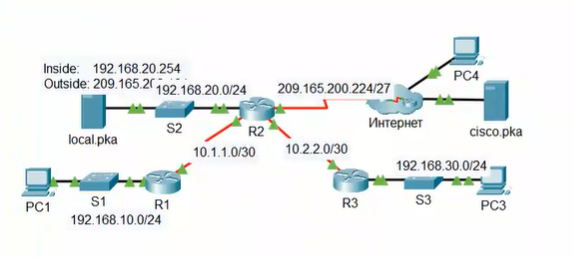

### Решённые лабораторные работы в программе Cisco PacketTracer

На последнем курсе университета мы решали лабораторные работы в программе Cisco PacketTracer, которая эмулировала работу интернет-сети: Роутеров, модемов, коммутаторов, концентраторов - настройке их самих, связей между ними, а также работе с устройствами умного дома

